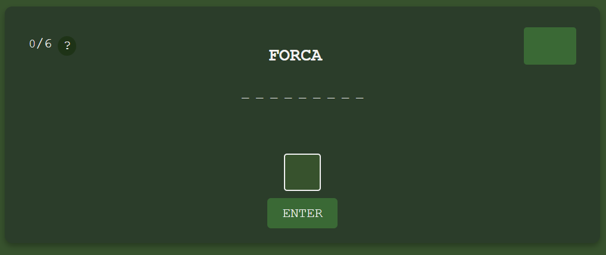
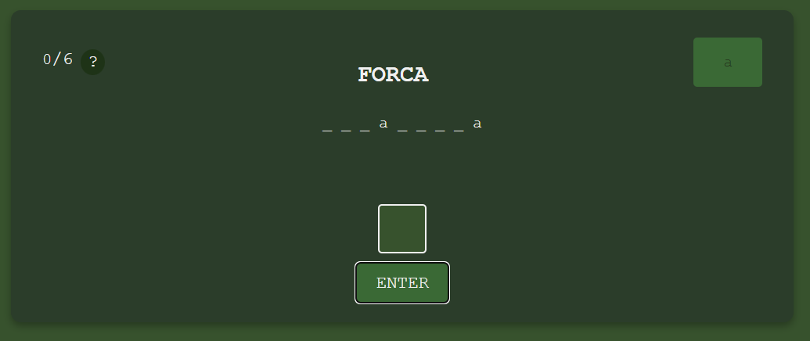
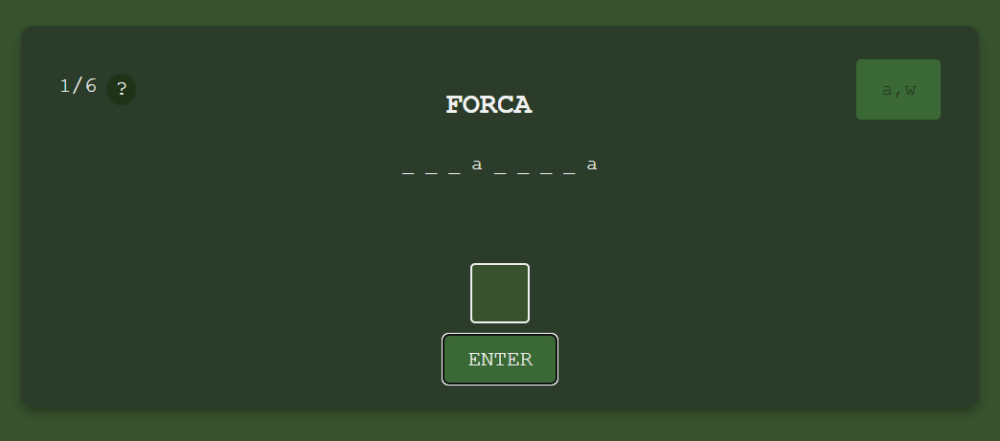
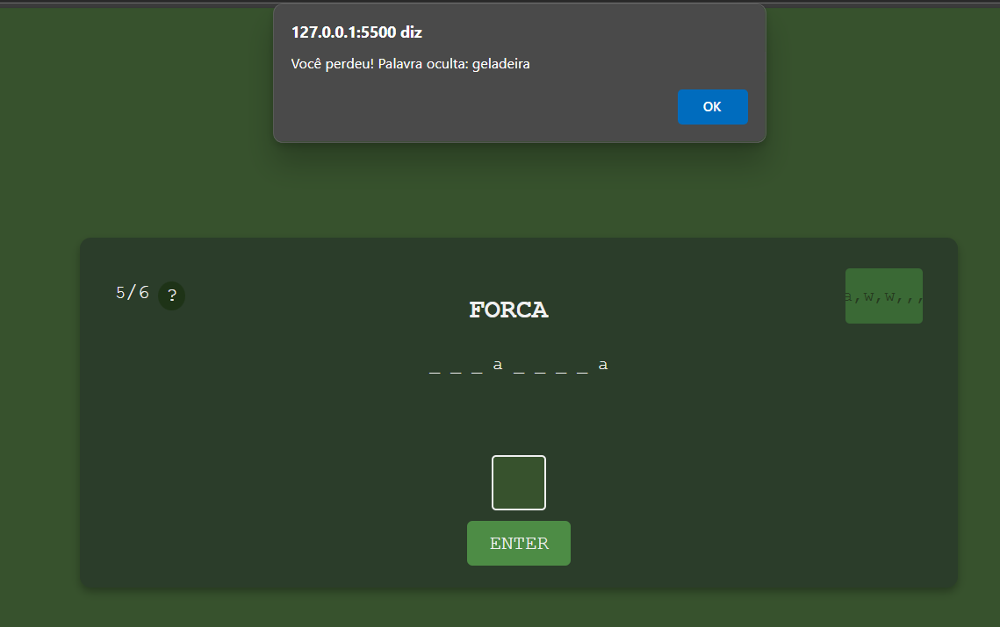

# Jogo da Forca

linguagens: Html, css, jinja2 e Python.
biblioteca: Flask

proposta: Um joguinha que recebe letras enviadas pelo usuario e as compara com a palavra que deve ser encontrada pelo usuario.

# Tela Inicial

Tela do jogo

# Ao acertar uma letra

Quando se acerta a letra da palavra secreta, o contador de tentativas continua o mesmo e a letra é marcada no letreiro das letras.

# Ao errar uma letra

Ao errar uma letra, o contador de tentativas sobre uma vez e a letra, já usada é mostrada no letreiro. A perca de tentativas podem ser: ao errar uma letra, ao falar uma letra que já foi enviada e ao enviar o espaço em branco.

# Ao chegar no limite de tentativas

Quando o usuario chega ao seu limite de tentativas (6), aparece um alert avisando sobre sua perda e dizendo qual era a palavra.
